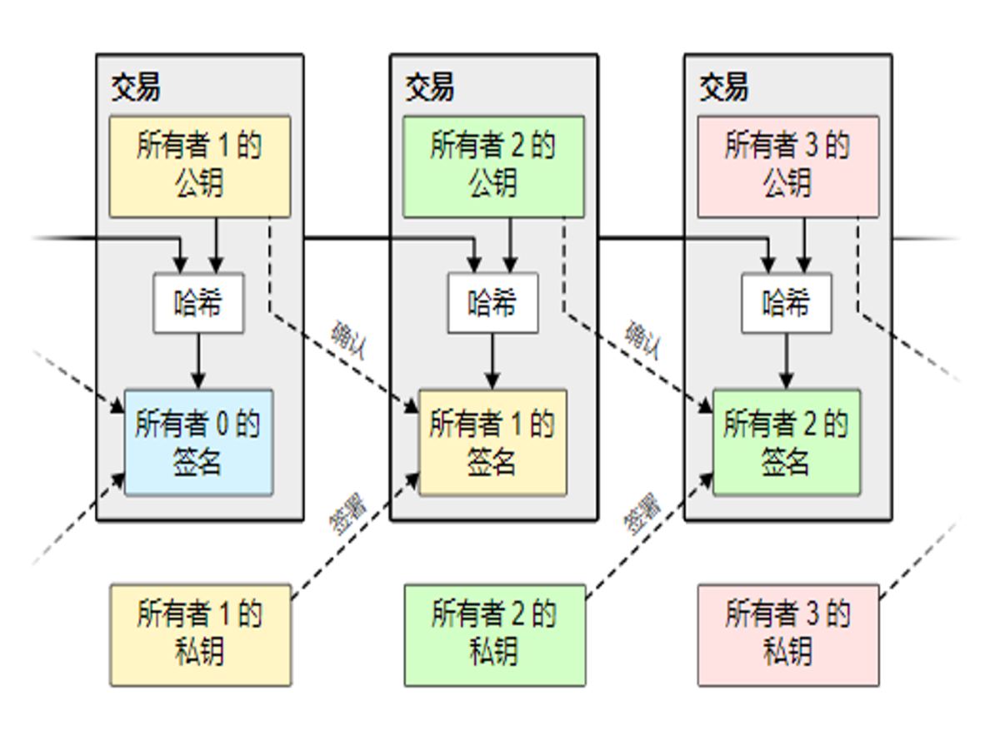
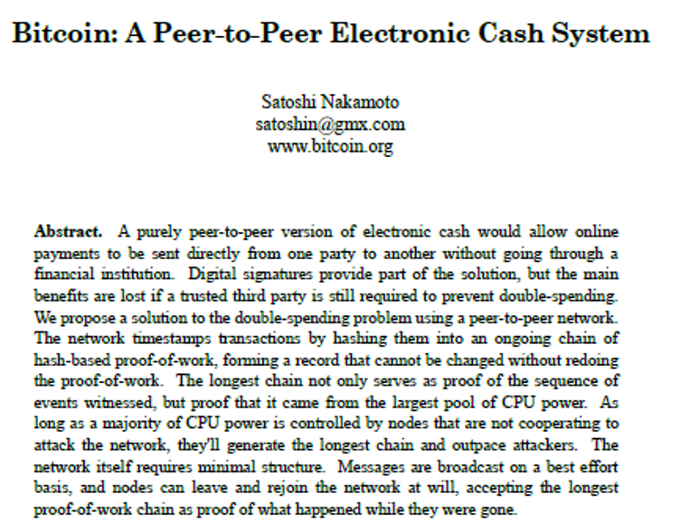

## 区块链技术原理

在[学习区块链的正确姿势](./chapter1_03%20correct_method_of_learn_blockchain.md)章节我们知道了学习区块链的正确姿势，这个章节我们用前面介绍的姿势概览下区块链的技术原理。

>* 通过比特币转账，我们可以理解区块链的基本原理；  
>* 通过以太坊我们可以初步理解智能合约；  
>* 通过Hyperledger Fabric我们可以将区块链技术应用到企业应用中。

### 比特币转账

比特币实际上是一个货币系统，要了解区块链的技术原理，最好的方式是从比特币转账机制开始。

举个例子，我——张应平要给乔帮主转账0.1个比特币购买个苹果手机。

这个过程分为两个阶段，第一个阶段是通过钱包转账，第二阶段是矿工使用矿机进行记账。

我们先看怎样通过钱包转账。钱包转账分为三个步骤：

* 第一步，钱包将0.1个比特币，也就是我们常说交易，和乔帮主的公钥做一个哈希运算。

* 第二步，钱包使用张应平的私钥对上面的哈希进行签名。

* 第三步，将签名、我的公钥附在0.1个比特币后面广播给乔帮主。

 
1-04-01 比特币转账

对照上边的图，大家就可以明白比特币转账的原理了，其实比特币钱包就只做了这么个事情，这三步都与密码息息相关，这也是为什么说密码学是区块链的基石。

在上面的转账过程中，张应平给乔帮主转0.1个比特币的过程中，为了确保0.1个比特币不会被其他人修改成0.2、0.3个比特币，所以这里使用了哈希算法对0.1个比特币和公钥做了一次哈希运算。

要验证我是否真的是给乔帮主转了0.1个比特币，只需要使用我的公钥对签名进行解密，得到原始哈希值，然后再使用哈希算法对我给乔帮主0.1个比特币再做一次哈希运算，最后将两次哈希运算结果进行比对，就可以验证0.1个比特币是否被篡改，以及是否是张应平发送的比特币了。

从上面的讲解我们可以看出，密码学在区块链的中价值。使用哈希算法，可以保证数据的不可篡改性，使用私钥进行数字签名，可以保证身份的唯一性。

当然密码的用途不只限于此，防止双重支付（双花、重放攻击）、保证数据隐私都与密码算法息息相关。总之，区块链与密码学的血缘关系非常紧密，因此才有人怀疑比特币的发明极有可能是一群密码领域造诣极深的专家。

***

密码学相关知识已经汗牛充栋，这里不再赘述，重点讲解一下**双重支付**。

2008年11月1日，一个化名为中本聪（Satoshi Nakamoto）的密码极客发布了比特币白皮书（《比特币：一种点对点的电子现金系统》）。中本聪在比特币白皮书里用大量的篇幅描述怎样防止双重支付。这也是区块链技术为什么区块链被称为价值互联网的原因。

 
1-04-02 比特币白皮书

什么叫双重支付？

举个例子，互联网可以让信息几乎零成本的传输，比如现在知识付费时代很多的大的IP，即使一个课程的价格非常低，但是由于课程可以被十几万或者几十万用户阅读，因此收益也会非常高。

但价值传递与信息传递却恰恰相反，我的一元钱给了老王就不能给小王。生活中如果我们用实物交割很容易解决双重支付的问题，比如说纸币，我将一元钱纸币给了老王就不能给小王，但价值一旦数字化，由于信息很容易被复制，同一笔数字资产就可能会被重复使用。

在比特币系统中，每笔交易都会加盖时间戳，所有交易都会按照时间顺序存储在链状的数据结构里，由于每笔交易都有一个唯一可信的时间戳，即使一笔交易被重复花费，但系统只认最早的那一笔交易，这样就可以有效防止一笔交易被同时花费，也就解决了价值传递的唯一性问题。

讲到这里，很多人肯定这样一个疑问，为什么支付宝、微信可以做到价值传递？这里需要说明的是支付宝、微信有一个中心化的权威机构来解决双重支付的问题。

比如说张三通过支付宝给李四转了100元，支付宝这时候会先销毁张三的100元，然后再发行新的100元支付给李四。整个支付过程只有支付宝发行的新币有效，这样就可以有效解决双重支付的问题。

但比特币是一个去中心化的系统，没有支付宝这样的中心化机构，所以他就需要采用可信时间戳来解决双重支付的问题。

双重支付是比特币白皮书里重点讲述的内容，理解了双重支付，也就容易理解为什么说区块链是价值互联网。

***

前面我们在讲我给乔帮主转0.1个比特币的时候，计算哈希、签名、发送这些动作其实是在钱包里完成的。钱包只是比特币中一种特殊的节点，它本身并不存储数据，真正存储数据的是全节点，也就是我们说的挖矿节点。

一旦我们在钱包里点击发送比特币，这时候就需要挖矿节点来干活了。挖矿节点会做以下四件事情，而这四步又与**共识机制**息息相关：

* 第一步，每个挖矿节点依据一个校验列表对每个交易进行独立验证。
* 第二步，通过完成工作量证明算法的计算，挖矿节点将交易记录独立打包进新区块。
* 第三步，每个挖矿节点独立对新区块进行校验并将区块组装进区块链。
* 第四步，每个节点对区块链进行独立选择，在工作量证明机制下选择累计工作量最大的区块链。

第一步就是挖矿节点通过一个校验列表进行交易验证，这个步骤其中就包含我们刚才说的验证签名、核对哈希是否一致。

第二步、第三步、第三步都需要**工作量证明机制**参与。

挖矿节点首先将交易打包到区块，也就是将我们刚才那笔转账记录打包到区块中（当然区块里一般会有大概1000笔左右的记录），接着挖矿成功的节点会将当前区块链接到区块链上；

需要注意的是由于比特币节点分布在全球，这时候很容易出现分叉的情况。这点如同我们去火车站买票排队一样，有时候会出现几个不同队伍，这时候大家会选择最长的那个队伍。为了保证全网数据的一致性，这时候我们会选择全网工作量累计最大的那条链。

通过密码学和共识机制两条主线大家就可以看懂区块链的基本原理了。如果对密码学、共识机制、交易、区块、区块链、P2P网络等概念还不清楚，大家可以学习[《大话区块链》](https://item.jd.com/12719282.html)相关章节。

### 以太坊复活智能合约

区块链除了发币，最大的创新就是智能合约，现在区块链能用于很多领域这个要归功于智能合约。区块链里面的密码学、分布式、共识机制、P2P都是大家已经非常熟悉的技术，而智能合约则是区块链独有的发明。

#### 智能合约

智能合约（Smart Contract）是在90年代由尼克·萨博（Nick Szabo）提出的理念，由于缺少可信的执行环境一直没有被应用到实际产业中。区块链技术的出现给智能合约带来了新的契机。

由于区块链是一个历史记录不可篡改的数据库，因此将计算机代码写在链上就可以让代码具备“智能”的特点，有点类似自动售货机。智能合约本质上就是一段运行在区块链上的代码，这段代码具备去中心化、公开透明、不可篡改等特点。

现实生活中，甲乙双方要进行一笔交易，我们需要签订一个合同，在合同中约定合同标的、内容、权利、义务等合同法规定的条款，双方盖章签字，一式两份。以买卖合同为例，一旦双方签订一份了合同，后续就要按照合同执行。但现实中由于大家的法律观念意识不强，经常会出现违约事件，尤其是在国内这种事情大家已经见怪不怪了。即使签订了合同也不会按照合同执行，这时候合同就变成了一张废纸，对双方都没有约束力。一旦出现纠纷，只能诉诸法律，由法院来强制执行。

那么有没有一种更有效的办法来确保合同的执行，答案是将上面的合同内容写在智能合约里，一旦智能合约中某个条件达成，合约就会自动执行。由于区块链信任的特点，使得合约的执行不依赖于人和现有中心化机构，这样就可以有效解决合同中出现的纠纷。

#### 以太坊的虚拟机

在比特币网络上我们只能进行转账，以太坊网络上不但可以转账，还可以运行智能合约。

以太坊虚拟机（EVM）是以太坊智能合约的运行环境。它不仅被沙箱封装起来，事实上它已经被完全隔离，也就是说运行在EVM内部的代码不能接触到网络、文件系统或者其它进程，甚至智能合约之间也只能有限地调用。

EVM的主要功能是将高级开发语言编写的智能合约编译成以太坊可以识别的字节码。一旦完成智能合约的编写，我们就需要将智能合约编译成字节码，部署到区块链上。

调用智能合约实际上就是向智能合约地址发起一笔交易，该交易不仅包含以太币，而且还包含数据。部署智能合约其实就是将一段代码运行在以太坊网络节点的以太坊虚拟机上。

由于代码运行在每个以太坊节点的虚拟机上，每个节点都在进行并行计算，这就牺牲了程序的效率，但同时可保证代码足够安全。另一方面智能合约适合于运行一些确定性的业务逻辑，如果运行一些随机性较强的业务，就需要对业务进行特殊处理，确保每个节点每次运行结果的一致性。

### Hyperledger Fabric企业应用先锋

超级账本引入权限控制机制将区块链带入到跨企业应用场景中，使得区块链技术不再局限于完全开放的公有链模式，分布式账本技术（Distributed Ledger Technologies，DLT）正在被主流企业认可并采用。（第三章节详细介绍）
