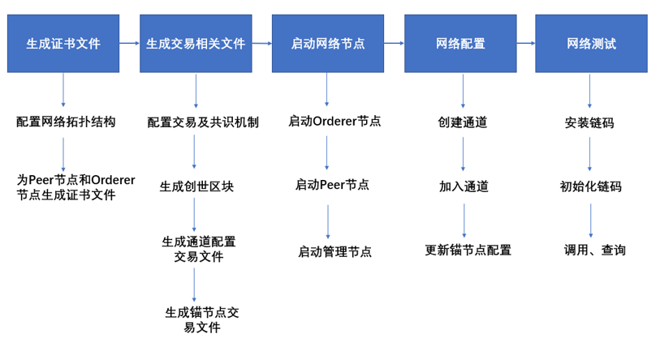

## 网络概况（5 Orderer +4 Peer+1 CLI）
下面要搭建的Fabric 网络中包含5个Orderer节点、Org1和Org2两个组织的四个Peer 节点，以及一个管理节点。

* Orderer节点采用了Raft共识机制。
* 四个Peer 节点分属于同一个管理域（example.com ）下的两个组织Org1和Org2 ，这两个组织都加入同一个应用通道（ my-channel）中。
* 每个组织中的第一个节点（peer0节点） 作为锚节点与其他组织进行通信，所有节点通过域名都可以相互访问。
* 管理节点的作用是在网络启动后供通过命令行进行通道及链码的操作。

 

4-01 Fabric网络搭建过程

入上图所示，要启动一个Fabric 网络，需要遵循如下的主要步骤：

**生成证书文件**  
1.生成节点和Orderer对应的证书文件（可以使用cyptogen工具完成）。

**生成交易相关文件**   
2. 生成Orderer的创世区块文件、通道的配置交易文件以及需要的锚节点交易文件（使用configtxgen 工具完成）。

**启动网络节点**   
3. 使用创世区块文件、证书文件启动Orderer节点。此时Orderer 采用指定的创世区块文件创建了系统通道。  
4. 根据组织文件分别启动Peer 节点。这个时候网络中不存在应用通道，Peer 节点也并没有加入网络中，也没有与Orderer 服务建立连接。需要通过客户端对其进行操作，让它加入网络和指定的应用通道中。
 
**网络配置**   
5. 使用配置交易文件，向系统通道发送交易，创建新的应用通道。  
6. 让对应的Peer 节点加入所创建的应用通道中，此时Peer 节点加入网络，可以准备接收交易了。

**网络测试**   
7. 用户通过客户端安装、初始化链码，链码容器启动后用户即可对链码进行调用（invoke、query）。
