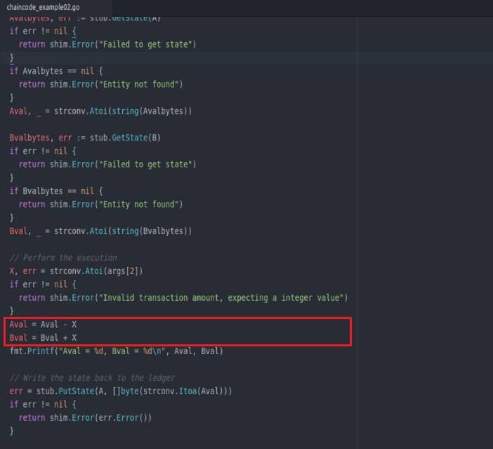

# Fabric 网络测试

Peer 加人应用通道后，就可以执行链码相关操作进行网络测试。链码在调用之前，必须先经过安装（ Install ）和实例化（ Instantiate ）两个步骤。链码的详细知识会在第5章节进一步讲解。

## 在Org1的Peer0上安装链码
安装链码是将链码拷贝到Peer的文件系统（filesystem）。

在Fabric网络中链码是按照名称和版本号来标识的，也就是说同一个链码再次安装链码必须修改名字或者版本号。peer chaincode install  -p参数指定的chaincode路径是链码在容器里相对$GOPATH/src的路径。

<div align=center>


 

4-06_01 链码的相对路径
</div>

```
# this installs the Go chaincode. For go chaincode -p takes the relative path from $GOPATH/src
peer chaincode install -n mycc -v 1.0 -p github.com/chaincode/chaincode_example02/go/
```
<div align=center>


 

4-06_02 在Org1 Peer0 成功安装链码
</div>

## 在Org2的Peer0上安装链码
下面实例化链码时，链码的背书策略包含Org1和Org2，因此这一步我们需要在Org2上安装链码。由于仅仅背书节点需要模拟执行链码，因此没有必要将链码安装到所有节点上。

**在安装链码时，确保下面四个环境变量设置为Org2的Peer0。**

```
# Environment variables for PEER0 in Org2

CORE_PEER_MSPCONFIGPATH=/opt/gopath/src/github.com/hyperledger/fabric/peer/crypto/peerOrganizations/org2.example.com/users/Admin@org2.example.com/msp
CORE_PEER_ADDRESS=peer0.org2.example.com:9051
CORE_PEER_LOCALMSPID="Org2MSP"
CORE_PEER_TLS_ROOTCERT_FILE=/opt/gopath/src/github.com/hyperledger/fabric/peer/crypto/peerOrganizations/org2.example.com/peers/peer0.org2.example.com/tls/ca.crt
```
将链码安装到Org2的Peer0上，与Org1的Peer0安装链码一样。下面的链码安装是将链码拷贝到Org2的Peer0文件系统（filesystem）上。

```
# this installs the Go chaincode. For go chaincode -p takes the relative path from $GOPATH/src
peer chaincode install -n mycc -v 1.0 -p github.com/chaincode/chaincode_example02/go/
```
<div align=center>


 

4-06_02 在Org2 Peer0 成功安装链码
</div>

## 实例化链码

接下来，在channel上实例化链码。这里需要特别注意-P参数——用来指定链码的背书策略。

* -P "AND ('Org1MSP.peer','Org2MSP.peer')"表明该链码需要经过Org1和Org2两个组织共同签名，
* -P "OR ('Org1MSP.peer','Org2MSP.peer')"表明该链码只需Org1或者Org2其中一个组织签名即可。

整个Fabric网络中链码实例化只需执行一次。链码执行初始化方法时，a和b各赋值100。

```
# be sure to replace the $CHANNEL_NAME environment variable if you have not exported it
# if you did not install your chaincode with a name of mycc, then modify that argument as well

peer chaincode instantiate -o orderer.example.com:7050 --tls --cafile /opt/gopath/src/github.com/hyperledger/fabric/peer/crypto/ordererOrganizations/example.com/orderers/orderer.example.com/msp/tlscacerts/tlsca.example.com-cert.pem -C $CHANNEL_NAME -n mycc -v 1.0 -c '{"Args":["init","a", "100", "b","200"]}' -P "AND ('Org1MSP.peer','Org2MSP.peer')"
```
<div align=center>


 

4-06_03 链码实例化
</div>

## 查询
查询验证a的值，显示a的值是100，与预期值相符。

```
# be sure to set the -C and -n flags appropriately

peer chaincode query -C $CHANNEL_NAME -n mycc -c '{"Args":["query","a"]}'
```
<div align=center>


 

4-06_04 查询链码
</div>

## 调用

invoke方法中，a向b转账100。

```
# be sure to set the -C and -n flags appropriately

peer chaincode invoke -o orderer.example.com:7050 --tls true --cafile /opt/gopath/src/github.com/hyperledger/fabric/peer/crypto/ordererOrganizations/example.com/orderers/orderer.example.com/msp/tlscacerts/tlsca.example.com-cert.pem -C $CHANNEL_NAME -n mycc --peerAddresses peer0.org1.example.com:7051 --tlsRootCertFiles /opt/gopath/src/github.com/hyperledger/fabric/peer/crypto/peerOrganizations/org1.example.com/peers/peer0.org1.example.com/tls/ca.crt --peerAddresses peer0.org2.example.com:9051 --tlsRootCertFiles /opt/gopath/src/github.com/hyperledger/fabric/peer/crypto/peerOrganizations/org2.example.com/peers/peer0.org2.example.com/tls/ca.crt -c '{"Args":["invoke","a","b","10"]}'
```
<div align=center>


 

4-06_05 链码转账逻辑
</div>

查询验证a的值，发现结果是90，与预期相同。
```
# be sure to set the -C and -n flags appropriately

peer chaincode query -C $CHANNEL_NAME -n mycc -c '{"Args":["query","a"]}'
```
<div align=center>


 

4-06_06 查询链码验证逻辑
</div>

## 在Org2的Peer1上安装链码并查询

在Org2的Peer1上安装链码并查询验证a的值，与之前Org1和Org2的Peer0结果相同。执行以下命令：

```
# Environment variables for PEER1 in Org2

CORE_PEER_MSPCONFIGPATH=/opt/gopath/src/github.com/hyperledger/fabric/peer/crypto/peerOrganizations/org2.example.com/users/Admin@org2.example.com/msp
CORE_PEER_ADDRESS=peer1.org2.example.com:10051
CORE_PEER_LOCALMSPID="Org2MSP"
CORE_PEER_TLS_ROOTCERT_FILE=/opt/gopath/src/github.com/hyperledger/fabric/peer/crypto/peerOrganizations/org2.example.com/peers/peer1.org2.example.com/tls/ca.crt
```
```
# this installs the Go chaincode. For go chaincode -p takes the relative path from $GOPATH/src
peer chaincode install -n mycc -v 1.0 -p github.com/chaincode/chaincode_example02/go/
```
```
CORE_PEER_MSPCONFIGPATH=/opt/gopath/src/github.com/hyperledger/fabric/peer/crypto/peerOrganizations/org2.example.com/users/Admin@org2.example.com/msp CORE_PEER_ADDRESS=peer1.org2.example.com:10051 CORE_PEER_LOCALMSPID="Org2MSP" CORE_PEER_TLS_ROOTCERT_FILE=/opt/gopath/src/github.com/hyperledger/fabric/peer/crypto/peerOrganizations/org2.example.com/peers/peer1.org2.example.com/tls/ca.crt peer channel join -b mychannel.block
```
```
# be sure to set the -C and -n flags appropriately

peer chaincode query -C $CHANNEL_NAME -n mycc -c '{"Args":["query","a"]}'

```
<div align=center>


 

4-06_06 在Org2 Peer1上验证链码逻辑
</div>

**通过以上链码安装、实例化及链码逻辑验证，表明Fabric网络运行正常。**